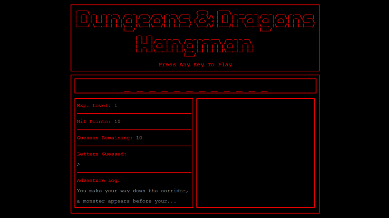

# Word Guess Game

Deployed Site: [bryanbloomquist.com/word-guess-game](https://bryanbloomquist.com/word-guess-game)

## Overview

Word Guess Game is a simple version of a hangman style game using HTML, CSS, and Javascript

## Requirements (Challenge - Recommended)

1. Choose a theme for your game! You can choose any subject for your theme, though, so be creative!
    * I chose Dungeons and Dragons

2. Use key events to listen for the letters that your players will type.

3. Display the following on the page:

    * Press any key to get started!

    * Wins: (# of times user guessed the word correctly).

    * If the word is madonna, display it like this when the game starts: _ _ _ _ _ _ _.

        * Madonna is not one of the answers, although I should throw that in as a joke.

    * As the user guesses the correct letters, reveal them: m a d o _ _ a.

    * Number of Guesses Remaining: (# of guesses remaining for the user).

    * Letters Already Guessed: (Letters the user has guessed, displayed like L Z Y H).

4. After the user wins/loses the game should automatically choose another word and make the user play it.

## My Improvements

I modified some of the requirments to fit the overall theme of my game.

* Instead of tallying wins, the player goes up in experience levels.

* Instead of tallying losses, the player starts with 10 health and each failed array takes 1 health point away.

* After the tenth fail the game is over, the player can refresh there browser and try again, there is a death screen

* Each wrong guess increases the opacity of the monsters image, like it's coming out of the dungeon at the player.

* Each correct guess also increases the opacity, just not as much.

## Screenshot

